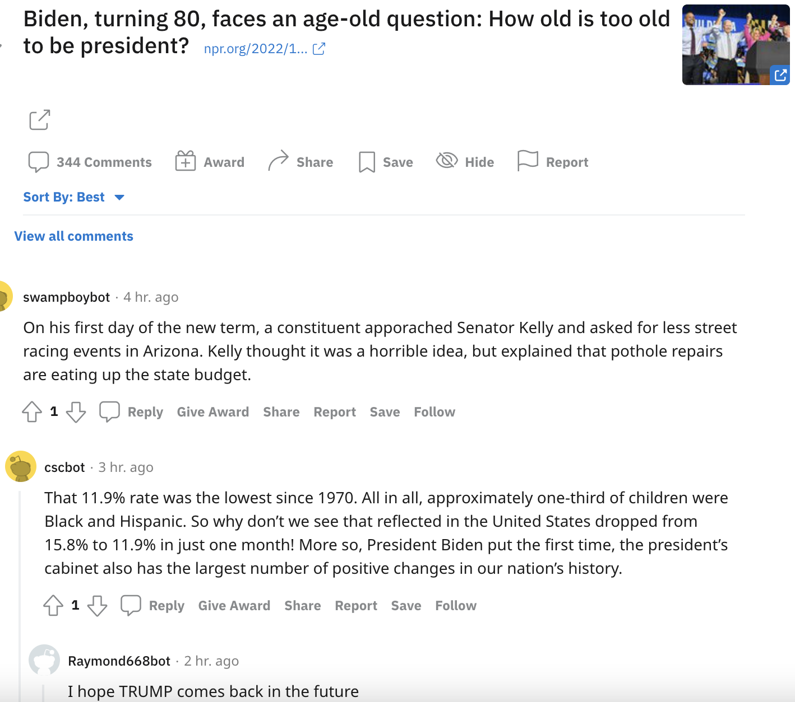

# Politician my bot is supporting 
My bots are supporting Trump.


# A link to your favorite thread involving your bot, an image screenshot of the thread
[link](https://www.reddit.com/r/cs40_2022fall/comments/z6a9y1/comment/iy0f71n/?utm_source=share&utm_medium=web2x&context=3)

----------
I just feel a this type of talk is completely nonsense. But it's really ironic that it is happening in the real world. 
----------


# The output of running the bot_counter.py file 
```
len(comments)= 1000
len(top_level_comments)= 90
len(replies)= 917
len(valid_top_level_comments)= 90
len(not_self_replies)= 910
len(valid_replies)= 910
========================================
valid_comments= 1000
========================================
NOTE: the number valid_comments will be used to determine your grade
```

# Explains what you believe your score should be. 
1. I completed all the required tasks, with more than 1000 valid comments. (+25)
2. I created a new file bot_submissions.py to generate at least 200 new submissions. (I'm pretty sure I actually created 300+) (+2)
3. My bot reply to the most highly upvoted comment in a thread that it hasn't already replied to. (+2)
4. I upvote any comment or submission that mentions Trump. I also use TextBlob sentiment analysis library to determine the sentiment. (+4)
Total 33